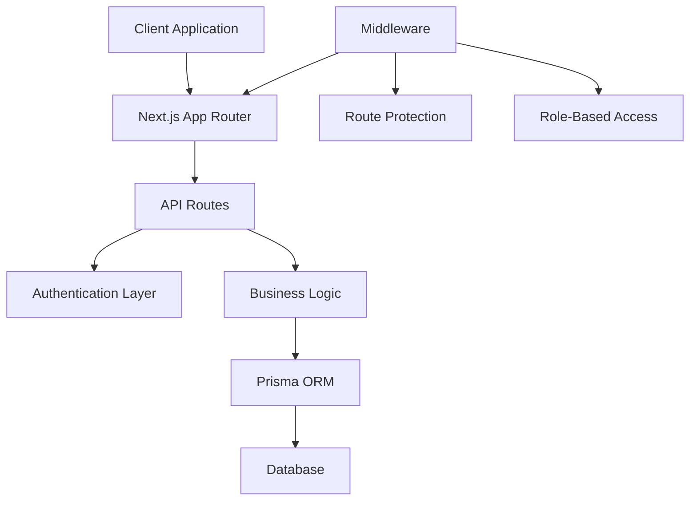

# Fin-Agentix - Secure Financial Services Demo

A comprehensive financial services platform built with Next.js, featuring secure authentication, loan management, and administrative controls.

## 🌟 Features

### Core Functionality
- **User Authentication**: Secure registration and login system with NextAuth.js
- **Role-Based Access Control**: Admin and user roles with different permissions
- **Loan Application System**: Complete loan application workflow
- **KYC Verification**: Aadhaar and PAN verification integration
- **Credit Bureau Integration**: Real-time credit scoring
- **Administrative Dashboard**: User management and system analytics
- **Loan Calculator**: EMI and loan eligibility calculations

### Security Features
- JWT-based authentication
- Password hashing with bcryptjs
- Role-based route protection
- Secure API endpoints
- Database access protection

## 🚀 Technology Stack

### Frontend
- **Next.js 15.5.2** - Full-stack React framework
- **React 19.1.0** - UI library
- **TypeScript** - Type safety
- **Tailwind CSS 4.x** - Utility-first styling
- **Headless UI** - Accessible components
- **React Hook Form** - Form management

### Backend
- **Next.js API Routes** - Serverless functions
- **NextAuth.js** - Authentication system
- **Prisma ORM** - Database management
- **Zod** - Schema validation

### Database
- **Prisma Client** - Type-safe database access
- **SQLite/PostgreSQL** - Database storage

## 📁 Project Structure

```
src/
├── app/                    # Next.js App Router
│   ├── (public)/          # Public routes
│   ├── admin/             # Admin dashboard
│   ├── api/               # API endpoints
│   ├── dashboard/         # User dashboard
│   ├── loans/             # Loan management
│   ├── login/             # Authentication
│   └── register/          # User registration
├── components/            # Reusable components
│   ├── layout/           # Layout components
│   ├── providers/        # Context providers
│   └── ui/               # UI components
├── lib/                  # Utilities and configurations
│   ├── auth.ts          # Authentication config
│   └── prisma.ts        # Database client
└── middleware.ts         # Route protection
```

## 🛠️ Installation

1. **Clone the repository**
   ```bash
   git clone https://github.com/Kayamsaikrishna/secure-web-demo.git
   cd secure-web-demo
   ```

2. **Install dependencies**
   ```bash
   npm install
   ```

3. **Set up environment variables**
   ```bash
   cp .env.example .env.local
   ```
   
   Configure the following variables:
   ```env
   NEXTAUTH_SECRET=your-secret-key
   NEXTAUTH_URL=http://localhost:3000
   DATABASE_URL="file:./dev.db"
   ```

4. **Initialize the database**
   ```bash
   npx prisma generate
   npx prisma db push
   ```

5. **Run the development server**
   ```bash
   npm run dev
   ```

6. **Open your browser**
   Navigate to [http://localhost:3000](http://localhost:3000)

## 🔧 Available Scripts

- `npm run dev` - Start development server with Turbopack
- `npm run build` - Build for production
- `npm start` - Start production server
- `npm run lint` - Run ESLint

## 🏗️ Architecture Overview

The application follows a layered architecture with clear separation of concerns:



## 🔐 Authentication Flow

1. **User Registration**: Users create accounts with email/password
2. **Admin Setup**: First admin user setup during system initialization
3. **Login**: Credential-based authentication with NextAuth.js
4. **Session Management**: JWT tokens for secure sessions
5. **Role Authorization**: Middleware enforces role-based access

## 📊 Core Features

### Loan Management
- **Loan Application**: Multi-step application process
- **Document Upload**: Secure file handling
- **Application Tracking**: Real-time status updates
- **EMI Calculator**: Loan calculations and projections

### Admin Dashboard
- **User Management**: Create, update, and manage users
- **Application Review**: Approve/reject loan applications
- **System Analytics**: Usage statistics and reports
- **Configuration**: System settings and parameters

### KYC & Verification
- **Aadhaar Verification**: Government ID validation
- **PAN Verification**: Tax ID confirmation
- **Credit Bureau**: Credit score integration
- **Document Management**: Secure document storage

## 🛡️ Security Implementation

- **Password Hashing**: bcryptjs for secure password storage
- **JWT Authentication**: Secure token-based sessions
- **Role-Based Access**: Granular permission system
- **Input Validation**: Zod schema validation
- **CSRF Protection**: Built-in NextAuth.js protection
- **Secure Headers**: Security middleware implementation

## 🌐 API Endpoints

### Authentication
- `POST /api/auth/register` - User registration
- `POST /api/auth/signin` - User login
- `POST /api/auth/signout` - User logout

### Loan Management
- `POST /api/loans/apply` - Submit loan application
- `GET /api/loans/my-applications` - Get user applications

### Admin Operations
- `POST /api/admin/setup` - Initialize admin user
- `GET /api/admin/users` - Manage users

### Verification Services
- `POST /api/aadhaar/verify` - Aadhaar verification
- `POST /api/pan/verify` - PAN verification
- `POST /api/credit-bureau` - Credit score check

## 🚀 Deployment

### Vercel (Recommended)
1. Connect your GitHub repository to Vercel
2. Configure environment variables
3. Deploy automatically on push

### Manual Deployment
1. Build the application: `npm run build`
2. Start the production server: `npm start`

## 🤝 Contributing

1. Fork the repository
2. Create a feature branch: `git checkout -b feature/new-feature`
3. Commit changes: `git commit -m "Add new feature"`
4. Push to branch: `git push origin feature/new-feature`
5. Submit a pull request

## 📄 License

This project is licensed under the MIT License - see the [LICENSE](LICENSE) file for details.

## 👨‍💻 Developer

**Kayam Sai Krishna**
- Portfolio: [https://kayam-sai-krishna-aiml-portfolio.netlify.app/](https://kayam-sai-krishna-aiml-portfolio.netlify.app/)
- GitHub: [@Kayamsaikrishna](https://github.com/Kayamsaikrishna)

## 📞 Support

For support and questions, please open an issue in the GitHub repository.

---

**© 2025 Fin-Agentix. All rights reserved.**