# Fin-Agentix India: Complete Registration & Verification Requirements

## Overview

This document outlines the comprehensive registration and verification requirements for Fin-Agentix India's multi-sector lending platform, designed to ensure RBI compliance, prevent fraud, and maintain the highest security standards in the Indian financial services sector.

## Registration Flow Architecture

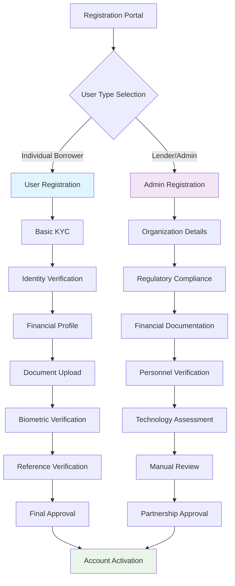

---

# USER REGISTRATION REQUIREMENTS

## Primary Identity Verification Framework

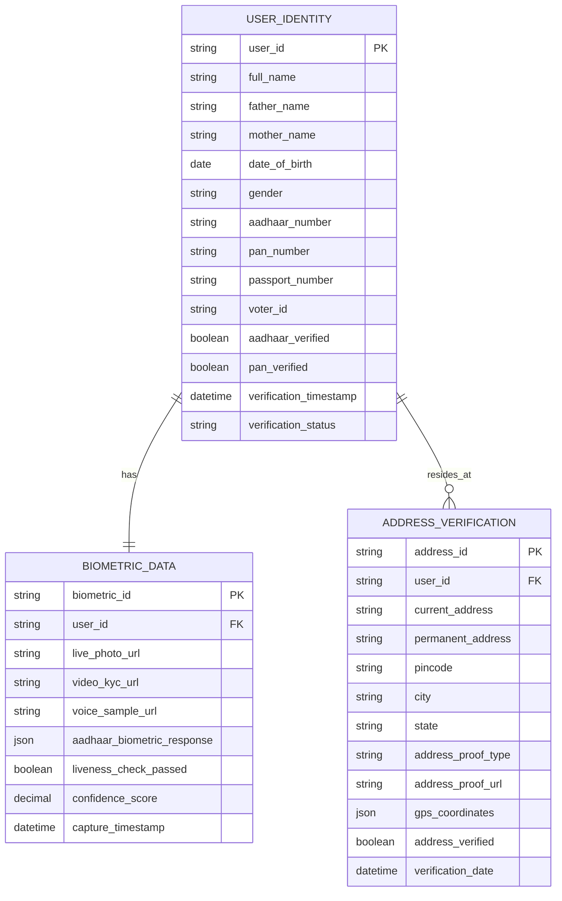

### Core Identity Information
- **Full Name**: As per Aadhaar/PAN card
- **Father's Name**: Mandatory for all applications
- **Mother's Name**: Required for additional verification
- **Date of Birth**: Cross-verified with multiple documents
- **Gender**: As per official documents
- **Marital Status**: Single/Married/Divorced/Widowed

### Government ID Verification
- **Aadhaar Number**: 12-digit with real-time OTP verification
- **PAN Number**: 10-character alphanumeric with income tax verification
- **Passport Number**: International travel document (if available)
- **Voter ID**: Electoral roll verification (optional)
- **Driving License**: Transport department verification (if available)

### Address Verification System

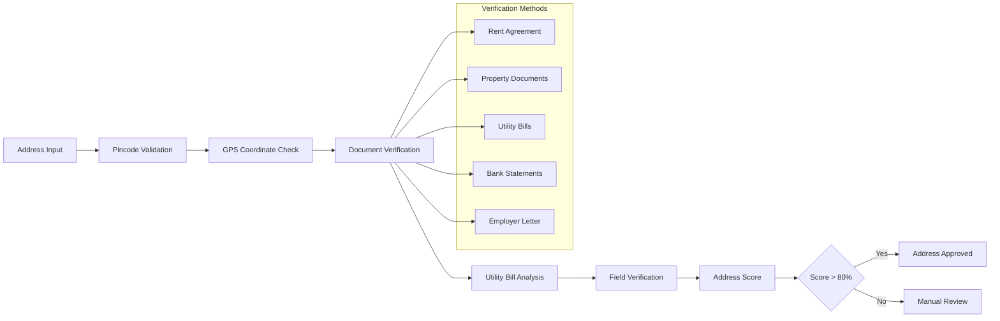

#### Current Residential Address
- **Full Address**: House/flat number, street, locality
- **Landmark**: Nearest recognizable location
- **City/Town**: Municipal corporation/panchayat area
- **District**: Administrative district
- **State**: Indian state/union territory
- **Pincode**: 6-digit postal code
- **Residence Type**: Owned/Rented/Family property
- **Years at Current Address**: Duration of stay

#### Permanent Address
- **Same as Current**: Checkbox option
- **Full Permanent Address**: If different from current
- **Native Place Details**: For migrant workers
- **Village/Town Details**: Rural area specifics

---

## Employment & Income Verification

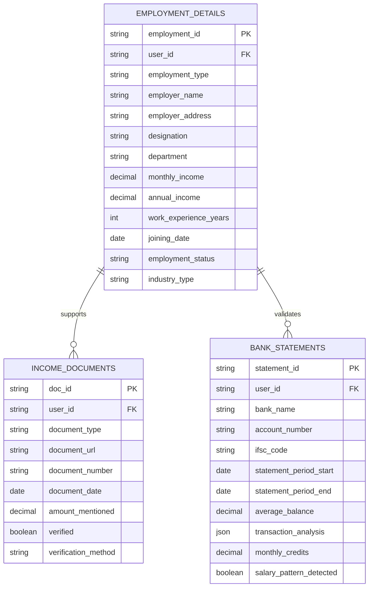

### Employment Categories & Requirements

#### Salaried Employees
- **Employer Information**
  - Company name and registration details
  - Office address and contact information
  - HR contact details
  - Employee ID and joining date
  - Current designation and department
  - Reporting manager information

- **Income Documentation**
  - Last 6 months salary slips
  - Form 16 (last 2 years)
  - Bank statements showing salary credits
  - Employment certificate/offer letter
  - EPF statement
  - ESI registration details

#### Self-Employed Professionals
- **Professional Details**
  - Type of profession/practice
  - Years in practice
  - Professional registration numbers
  - Office address and setup
  - Client base information

- **Income Proof**
  - ITR filings (last 3 years)
  - Form 26AS
  - CA certified income certificate
  - Bank statements (18 months)
  - GST returns (if applicable)
  - Professional fees receipts

#### Business Owners
- **Business Information**
  - Business name and type
  - Registration details (ROC/Registrar)
  - GST registration
  - Business address and setup
  - Number of employees
  - Years in business

- **Financial Documents**
  - Business ITR (last 3 years)
  - Profit & Loss statements
  - Balance sheets
  - Bank statements (business account)
  - GST returns
  - Trade license
  - Sales invoices and contracts

---

## Financial Profile Assessment

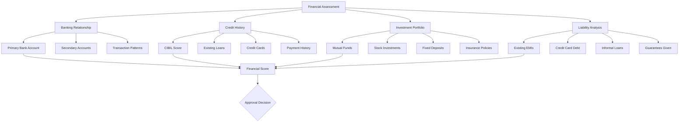

### Banking Relationship
- **Primary Bank Account**
  - Bank name and branch
  - Account number and type
  - IFSC code
  - Account opening date
  - Average monthly balance
  - Relationship duration

- **Additional Accounts**
  - Salary account details
  - Savings accounts in other banks
  - Current accounts (for business)
  - Joint accounts information
  - Demat account details

### Credit Bureau Analysis
- **CIBIL Score**: Real-time score fetching
- **Credit History**: Last 7 years detailed report
- **Active Loans**: All existing credit facilities
- **Credit Cards**: Limit, utilization, payment history
- **Enquiries**: Recent credit applications
- **Defaults**: Any past due amounts or settlements

### Investment & Assets
- **Mutual Fund Holdings**: Portfolio value and SIP details
- **Stock Investments**: Demat account holdings
- **Fixed Deposits**: Bank FDs and company deposits  
- **PPF/NSC**: Long-term savings instruments
- **Life Insurance**: Policy details and premiums
- **Property Ownership**: Real estate investments
- **Vehicle Ownership**: Owned vehicles and loans

---

## Educational & Professional Background

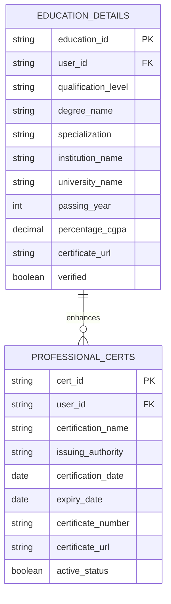

### Academic Qualifications
- **Highest Qualification**: Degree level achieved
- **Degree Details**: Course name and specialization
- **Institution Information**: College/university name and location
- **Academic Performance**: Percentage/CGPA achieved
- **Year of Completion**: Passing year
- **Certificate Verification**: Document upload and verification

### Professional Certifications
- **Technical Certifications**: IT, engineering, medical licenses
- **Financial Certifications**: CFA, FRM, CA, CS, CMA
- **Management Qualifications**: MBA, specialized management courses
- **Skill-based Certifications**: Industry-specific skills
- **Government Certifications**: Professional practice licenses

---

## Family & Dependent Information

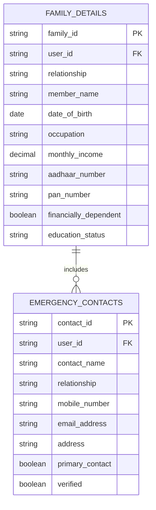

### Immediate Family
- **Spouse Details** (if married)
  - Full name and age
  - Occupation and income
  - Aadhaar and PAN numbers
  - Employment details

- **Children Information**
  - Names and ages
  - Education status
  - Special needs (if any)
  - Dependency status

- **Parents Details**
  - Names and ages
  - Health status
  - Dependency for support
  - Income sources (pension, etc.)

### Emergency Contacts
- **Primary Emergency Contact**
  - Name and relationship
  - Mobile number (verified)
  - Email address
  - Residential address
  - Alternative contact number

- **Secondary Emergency Contact**
  - Different from primary
  - Complete contact information
  - Relationship to applicant
  - Availability confirmation

---

## Reference Verification System

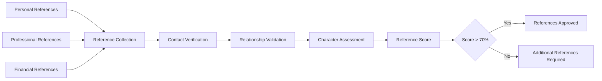

### Personal References (Minimum 2)
- **Reference 1 Details**
  - Full name and relationship
  - Contact information
  - Address details
  - Years of association
  - Character assessment questions

- **Reference 2 Details**
  - Different locality/circle
  - Independent verification
  - Relationship duration
  - Character confirmation

### Professional References
- **Current Employer Reference**
  - HR contact information
  - Immediate supervisor details
  - Employment confirmation
  - Performance assessment

- **Previous Employer** (if applicable)
  - Reason for leaving
  - Performance feedback
  - Rehire eligibility
  - Contact verification

---

## Digital Footprint & Behavioral Analysis

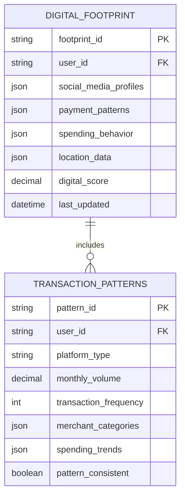

### Digital Payment History
- **UPI Transaction Patterns**
  - Monthly transaction volume
  - Frequency of transactions
  - Merchant categories
  - P2P payment behavior
  - Bill payment regularity

- **E-commerce Behavior**
  - Shopping platforms used
  - Purchase categories
  - Payment methods preferred
  - Return/refund patterns
  - Loyalty program participation

### Utility & Service Payments
- **Regular Bill Payments**
  - Electricity bill payments
  - Mobile/DTH recharges
  - Internet/broadband bills
  - Insurance premium payments
  - Loan EMI payment patterns

---

## Biometric & Live Verification

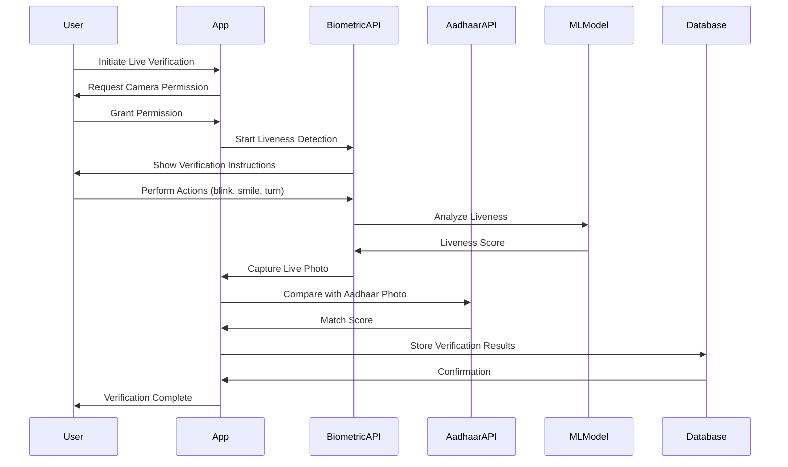

### Live Photo Capture
- **Liveness Detection**: Anti-spoofing measures
- **Photo Quality**: Resolution and clarity standards
- **Facial Recognition**: ML-based face matching
- **Aadhaar Photo Matching**: Government database comparison

### Video KYC Session
- **Real-time Video Call**: With verification agent
- **Document Verification**: Live document validation
- **Question-Answer Session**: Identity confirmation
- **Recording Storage**: Encrypted video storage
- **Compliance Recording**: RBI guideline adherence

### Voice Verification
- **Voice Sample Recording**: Unique voice pattern
- **Text Reading**: Standard verification text
- **Voice Print Creation**: Biometric voice signature
- **Multi-language Support**: Regional language options

---

## Document Upload Requirements

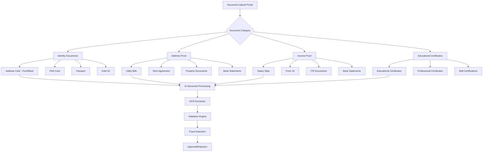

### Document Quality Standards
- **Image Resolution**: Minimum 300 DPI
- **File Format**: PDF, JPG, PNG accepted
- **File Size**: Maximum 5MB per document
- **Clarity Requirements**: All text clearly readable
- **Original Documents**: No photocopies of photocopies

### Mandatory Document Categories

#### Identity Documents
- **Aadhaar Card**: Front and back sides
- **PAN Card**: Clear, unmasked image
- **Passport**: First and last page (if available)
- **Recent Photographs**: Passport size, colored

#### Address Proof (Any 2)
- **Utility Bills**: Electricity, gas, water (last 3 months)
- **Bank Statements**: With address, last 3 months
- **Rent Agreement**: Registered/notarized
- **Property Tax Receipt**: Municipal corporation issued
- **Telephone/Broadband Bills**: Last 3 months

#### Income Proof
- **Salaried**: Salary slips (6 months) + Form 16
- **Self-employed**: ITR + computation + bank statements
- **Business**: Business ITR + P&L + balance sheet

---

# ADMIN/LENDER REGISTRATION REQUIREMENTS

## Organizational Identity Framework

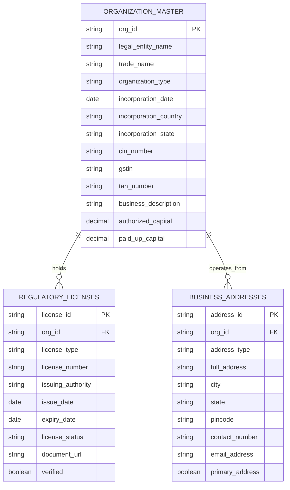

### Legal Entity Information
- **Exact Legal Name**: As per certificate of incorporation
- **Trade Name/Brand Name**: Commercial operating name
- **Entity Type**: Private Ltd/Public Ltd/Partnership/LLP/Trust/Society
- **Date of Incorporation**: Company registration date
- **State of Incorporation**: Registration jurisdiction
- **Country of Origin**: India/Foreign entity details

### Corporate Identifiers
- **Corporate Identity Number (CIN)**: MCA issued unique identifier
- **Goods & Services Tax Number (GSTIN)**: Tax registration number
- **Tax Deduction Account Number (TAN)**: Income tax deduction number
- **Permanent Account Number (PAN)**: Income tax permanent account
- **Import Export Code (IEC)**: For international business
- **Foreign Collaboration Approval**: If applicable

---

## Regulatory Compliance Matrix

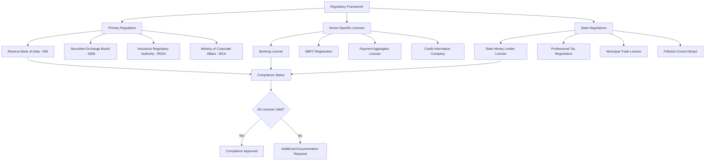

### RBI Regulatory Requirements

#### For Banks
- **Banking License**: RBI issued banking license
- **Certificate of Commencement**: Business commencement certificate
- **CRAR Compliance**: Capital adequacy ratio maintenance
- **Statutory Returns**: Regular RBI return filings
- **Audit Reports**: RBI approved auditor reports

#### for NBFCs
- **NBFC Registration**: Certificate of Registration with RBI
- **Net Owned Fund**: Minimum NOF compliance certificate
- **Credit Rating**: Mandatory credit rating from approved agencies
- **Asset Classification**: NPA classification and reporting
- **Prudential Norms**: Compliance with RBI prudential norms

#### For Fintech Companies
- **Business Registration**: Corporate registration certificate
- **Partnership Agreements**: Tie-ups with banks/NBFCs
- **Technology Certifications**: IT security and data protection
- **Customer Agreements**: Lending service provider agreements
- **Compliance Framework**: Digital lending guideline adherence

### SEBI Requirements (if applicable)
- **Portfolio Management License**: For investment services
- **Investment Advisory Registration**: For financial advisory
- **Credit Rating Registration**: For rating agencies
- **Merchant Banking Registration**: For corporate finance services

---

## Financial Documentation & Assessment

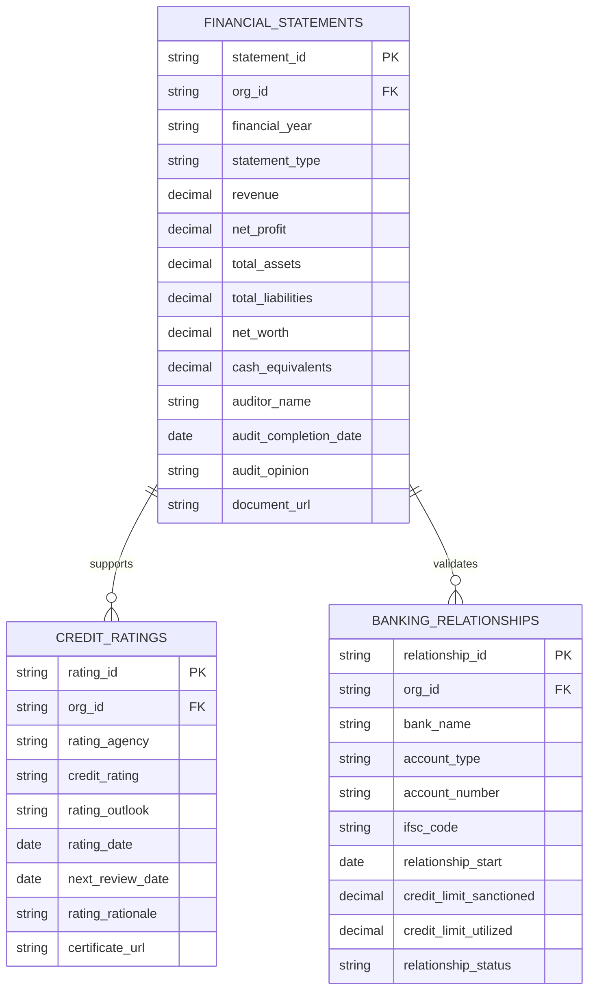

### Audited Financial Statements (Last 3 Years)
- **Profit & Loss Statement**: Revenue, expenses, profit margins
- **Balance Sheet**: Assets, liabilities, net worth position
- **Cash Flow Statement**: Operating, investing, financing activities
- **Notes to Accounts**: Detailed explanations and policies
- **Auditor's Report**: Independent auditor opinion and observations

### Financial Health Indicators
- **Revenue Growth**: Year-over-year revenue trends
- **Profitability Ratios**: Gross, net, operating profit margins
- **Liquidity Ratios**: Current ratio, quick ratio, cash ratio
- **Leverage Ratios**: Debt-to-equity, interest coverage
- **Return Ratios**: ROA, ROE, ROIC

### Credit Rating Information
- **Rating Agency**: CRISIL, ICRA, CARE, Brickwork, etc.
- **Current Rating**: Long-term and short-term ratings
- **Rating Outlook**: Stable, positive, negative, developing
- **Rating History**: Past 5 years rating movements
- **Rating Rationale**: Factors supporting the rating

---

## Key Personnel Verification

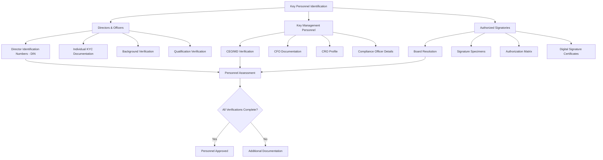

### Board of Directors
- **Director Details**: Complete list with DIN numbers
- **Director Categories**: Independent, executive, nominee directors
- **Appointment Dates**: Board appointment and reappointment dates
- **Qualifications**: Educational and professional qualifications
- **Other Directorships**: List of other companies and positions
- **Background Check**: Criminal record verification

### Key Management Personnel
- **Chief Executive Officer/Managing Director**
  - Complete resume and career history
  - Educational qualifications and certifications
  - Previous employment and achievements
  - Regulatory approvals (if required)
  - Personal financial statement

- **Chief Financial Officer**
  - CA/CMA/MBA Finance qualification
  - Experience in financial management
  - Previous audit findings and observations
  - Regulatory compliance experience

- **Chief Risk Officer**
  - Risk management qualification and experience
  - Understanding of regulatory requirements
  - Previous risk management track record
  - Credit and operational risk expertise

### Authorized Signatories
- **Board Resolution**: Authorizing signatory powers
- **Signature Specimens**: Verified signature samples
- **Authorization Matrix**: Limits and approval hierarchy
- **Digital Signatures**: Class 3 digital signature certificates
- **Delegation of Powers**: Clear authority definition

---

## Technology & Security Assessment

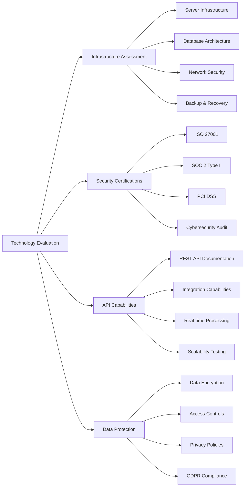

### IT Infrastructure Documentation
- **System Architecture**: High-level system design and components
- **Database Design**: Data model and security implementation
- **Network Topology**: Network design and security measures
- **Hosting Environment**: Cloud/on-premise infrastructure details
- **Scalability Plan**: Capacity planning and growth strategy

### Security Certifications
- **ISO 27001**: Information security management certification
- **SOC 2 Type II**: Security, availability, processing integrity
- **PCI DSS**: Payment card industry data security standard
- **Penetration Testing**: Regular security vulnerability assessment
- **Vulnerability Management**: Process for handling security issues

### API Integration Capabilities
- **API Documentation**: Comprehensive integration guidelines
- **Authentication Methods**: OAuth, JWT, API key management
- **Rate Limiting**: API usage controls and monitoring
- **Error Handling**: Proper error codes and response formats
- **Webhook Support**: Real-time notification capabilities

### Data Protection Framework
- **Data Encryption**: At-rest and in-transit encryption standards
- **Access Controls**: Role-based access control implementation
- **Data Retention**: Clear data retention and deletion policies
- **Backup Strategy**: Regular backups and disaster recovery
- **Privacy Compliance**: Data protection regulation adherence

---

## Operational Due Diligence

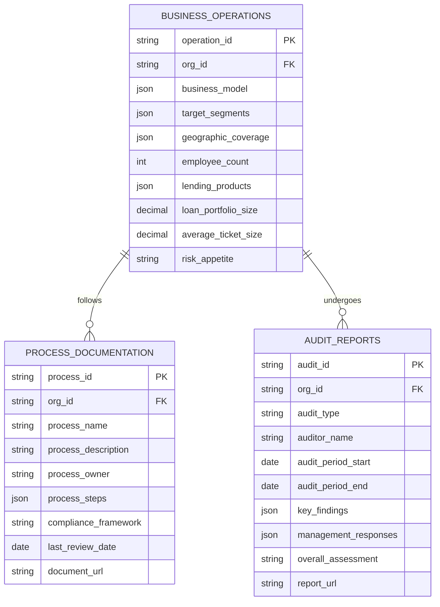

### Business Model Assessment
- **Revenue Streams**: Detailed breakdown of income sources
- **Customer Segments**: Target customer profiles and segments
- **Value Proposition**: Unique selling points and market positioning
- **Distribution Channels**: Customer acquisition and service delivery
- **Cost Structure**: Major cost components and optimization

### Operational Processes
- **Loan Origination Process**: End-to-end lending workflow
- **Credit Assessment**: Risk evaluation methodology
- **Loan Servicing**: Customer service and collection processes
- **Compliance Monitoring**: Regulatory compliance procedures
- **Risk Management**: Risk identification and mitigation processes

### Internal Controls
- **Segregation of Duties**: Clear role separation and authorization
- **Approval Hierarchy**: Multi-level approval processes
- **Exception Handling**: Process for handling unusual cases
- **Audit Trail**: Complete transaction and decision logging
- **Review Mechanisms**: Regular process review and improvement

---

## Partnership & Integration Assessment

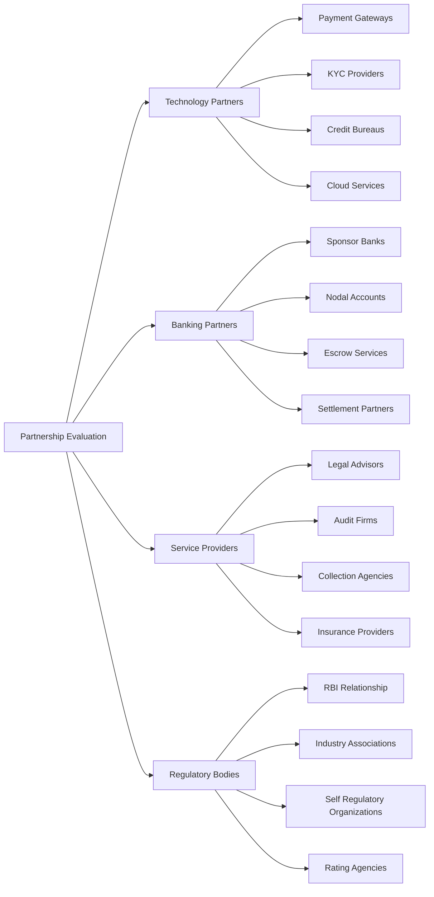

### Existing Technology Partnerships
- **Payment Gateway Partners**: Razorpay, CCAvenue, PayU, etc.
- **KYC Service Providers**: Bureau verification services
- **Credit Bureau Relationships**: CIBIL, Experian, Equifax partnerships
- **Cloud Service Providers**: AWS, Azure, GCP service agreements
- **API Integration Partners**: Third-party service integrations

### Banking Relationships
- **Sponsor Bank Agreements**: Partnership with scheduled banks
- **Nodal Account Setup**: Dedicated accounts for fund management
- **Escrow Services**: Customer fund protection mechanisms
- **Settlement Partners**: Payment settlement and reconciliation
- **NACH/ECS Partnerships**: Automated payment collection

### Service Provider Network
- **Legal Advisory**: Regulatory compliance and contract management
- **Chartered Accountants**: Audit, taxation, and financial advisory
- **Collection Agencies**: Debt recovery and management services
- **Insurance Partners**: Credit insurance and protection covers
- **Valuation Services**: Asset and collateral valuation

---

## Document Upload Requirements - Admin

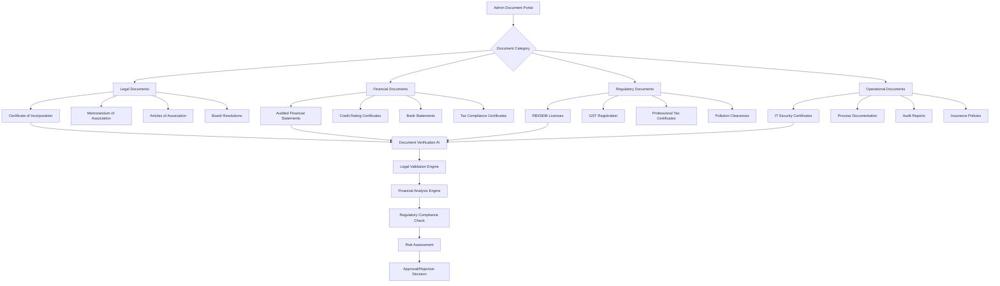

### Legal & Corporate Documents
- **Certificate of Incorporation**: Company registration proof
- **Memorandum of Association**: Company objectives and scope
- **Articles of Association**: Internal governance rules
- **Partnership Deed**: For partnership firms
- **Trust Deed**: For trust entities
- **Board Resolutions**: Key business decisions and authorizations
- **Power of Attorney**: Legal representation documents
- **Shareholding Pattern**: Ownership structure details

### Financial & Audit Documents
- **Audited Financial Statements**: Last 3 years comprehensive reports
- **Management Discussion & Analysis**: Strategic business overview
- **Cash Flow Statements**: Detailed cash movement analysis
- **Tax Audit Reports**: Income tax compliance certificates
- **GST Returns**: Quarterly and annual GST filings
- **Bank Statements**: All operational accounts (12 months)
- **Credit Rating Reports**: Detailed rating analysis and rationale

### Regulatory Compliance Documents
- **RBI Registration Certificate**: For banks and NBFCs
- **SEBI Registration**: For capital market intermediaries
- **State Government Licenses**: Money lender licenses
- **Municipal Approvals**: Trade licenses and permits
- **Environmental Clearances**: Pollution control certificates
- **Labour Law Compliances**: PF, ESI, and labour registrations

### Operational & Risk Management
- **Risk Management Framework**: Comprehensive risk policies
- **Internal Audit Reports**: Last 2 years audit findings
- **Compliance Certificates**: Regulatory compliance status
- **Insurance Policies**: Professional indemnity, D&O coverage
- **Business Continuity Plan**: Disaster recovery and continuity
- **IT Security Policies**: Cybersecurity framework and controls

---

## Verification & Approval Workflow

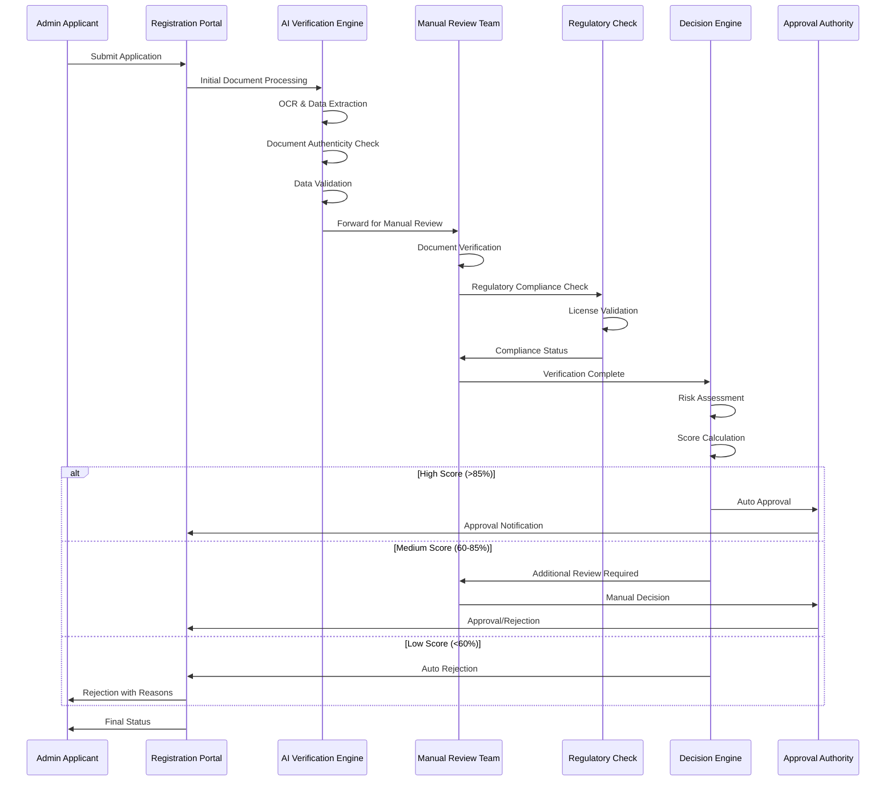

### Stage 1: Automated Processing (0-2 hours)
- **Document Upload Validation**: File format, size, quality checks
- **OCR Data Extraction**: Automated text extraction from documents
- **Basic Data Validation**: Format checks, calculation validation
- **Duplicate Check**: Existing registration verification
- **Blacklist Screening**: Regulatory blacklist verification

### Stage 2: AI-Powered Analysis (2-6 hours)
- **Document Authenticity**: Fraud detection and verification
- **Financial Health Analysis**: Ratio analysis and trend evaluation
- **Regulatory Compliance**: License validity and status check
- **Risk Scoring**: Automated risk assessment based on multiple factors
- **Preliminary Decision**: Auto-approval, manual review, or rejection

### Stage 3: Manual Review (6-48 hours)
- **Document Expert Review**: Detailed document analysis
- **Financial Analysis**: Deep-dive financial health assessment
- **Regulatory Verification**: Direct verification with regulatory bodies
- **Reference Checks**: Verification of provided references
- **Site Visit**: Physical verification (for high-value partnerships)

### Stage 4: Final Decision (48-72 hours)
- **Compliance Officer Review**: Final compliance assessment
- **Risk Committee Approval**: High-risk application review
- **Partnership Agreement**: Contract negotiation and finalization
- **Onboarding Process**: System integration and testing
- **Go-Live Certification**: Final operational approval

---

## Ongoing Compliance & Monitoring

```mermaid
erDiagram
    COMPLIANCE_MONITORING {
        string monitoring_id PK
        string org_id FK
        string compliance_type
        date review_date
        string compliance_status
        json findings
        json remedial_actions
        date next_review_date
        string reviewer_name
    }
    
    REGULATORY_UPDATES {
        string update_id PK
        string regulation_type
        string update_description
        date effective_date
        string impact_assessment
        json required_actions
        string compliance_deadline
        boolean organization_notified
    }
    
    PERIODIC_ASSESSMENTS {
        string assessment_id PK
        string org_id FK
        string assessment_type
        date assessment_date
        decimal compliance_score
        json risk_rating
        json recommendations
        string assessor_name
        date next_assessment_due
    }
    
    COMPLIANCE_MONITORING ||--o{ REGULATORY_UPDATES : tracks
    COMPLIANCE_MONITORING ||--o{ PERIODIC_ASSESSMENTS : includes
```

### Continuous Monitoring Requirements
- **Monthly Compliance Reports**: Regular compliance status updates
- **Quarterly Risk Assessments**: Risk profile evaluation and updates
- **Annual Comprehensive Review**: Complete partnership assessment
- **Regulatory Update Compliance**: Adherence to new regulations
- **Performance Monitoring**: Key performance indicator tracking

### Mandatory Renewals & Updates
- **License Renewals**: Timely renewal of all regulatory licenses
- **Certificate Updates**: Updated certificates and compliance documents
- **Financial Statement Submission**: Annual audited financial statements
- **System Security Updates**: Regular security assessments and updates
- **Process Documentation**: Updated operational procedures and controls

---

## Risk Assessment Matrix

```mermaid
graph TB
    A[Risk Assessment Framework] --> B[Financial Risk]
    A --> C[Operational Risk]
    A --> D[Regulatory Risk]
    A --> E[Reputational Risk]
    A --> F[Technology Risk]
    
    B --> B1[Credit Risk - Default Probability]
    B --> B2[Liquidity Risk - Cash Flow]
    B --> B3[Market Risk - Interest Rate]
    B --> B4[Concentration Risk - Portfolio]
    
    C --> C1[Process Risk - Operational Failures]
    C --> C2[People Risk - Key Person Dependency]
    C --> C3[System Risk - Technology Failures]
    C --> C4[External Risk - Vendor Dependencies]
    
    D --> D1[Compliance Risk - Regulatory Violations]
    D --> D2[Legal Risk - Litigation Exposure]
    D --> D3[Policy Risk - Regulatory Changes]
    D --> D4[Licensing Risk - License Revocation]
    
    E --> E1[Brand Risk - Reputation Damage]
    E --> E2[Customer Risk - Customer Complaints]
    E --> E3[Media Risk - Negative Publicity]
    E --> E4[Social Risk - Social Media Impact]
    
    F --> F1[Cybersecurity Risk - Data Breaches]
    F --> F2[System Risk - Downtime]
    F --> F3[Integration Risk - API Failures]
    F --> F4[Scalability Risk - Performance Issues]
    
    G[Overall Risk Score] --> H{Risk Level}
    H -->|Low Risk <30| I[Fast Track Approval]
    H -->|Medium Risk 30-70| J[Standard Review]
    H -->|High Risk >70| K[Enhanced Due Diligence]
    
    B1 --> G
    C1 --> G
    D1 --> G
    E1 --> G
    F1 --> G
```

### Risk Scoring Methodology
- **Financial Stability (30%)**: Financial health and performance
- **Regulatory Compliance (25%)**: License validity and compliance history
- **Operational Maturity (20%)**: Process maturity and control effectiveness
- **Technology Infrastructure (15%)**: IT security and system reliability
- **Management Quality (10%)**: Leadership experience and track record

### Risk Mitigation Requirements
- **High-Risk Organizations**: Enhanced monitoring and reporting
- **Medium-Risk Organizations**: Standard monitoring with quarterly reviews
- **Low-Risk Organizations**: Annual reviews with exception-based monitoring
- **Risk Evolution Tracking**: Continuous risk profile monitoring
- **Remediation Planning**: Action plans for risk reduction

---

## Success Metrics & KPIs

```mermaid
dashboard
    title Registration & Onboarding Performance Dashboard
    
    scorecard
        title User Registration Metrics
        metric completionRate value 85% target 90%
        metric approvalTime value "4.2 hours" target "< 6 hours"
        metric documentAccuracy value 94% target 95%
        metric verificationSuccess value 91% target 93%
    
    scorecard  
        title Admin Registration Metrics
        metric adminCompletionRate value 76% target 80%
        metric avgProcessingTime value "32 hours" target "< 48 hours"
        metric complianceScore value 88% target 90%
        metric partnershipConversion value 82% target 85%
    
    scorecard
        title System Performance
        metric apiResponseTime value "245ms" target "< 500ms"
        metric systemUptime value 99.7% target 99.9%
        metric fraudDetectionRate value 96.3% target 95%
        metric falsePositiveRate value 2.1% target "< 3%"
    
    scorecard
        title Compliance & Risk
        title regualtoryCompliance value 98.5% target 100%
        metric riskAssessmentAccuracy value 89% target 90%
        metric auditFindings value 3 target "< 5"
        metric complianceViolations value 0 target 0
```

### Registration Performance KPIs
- **User Registration Completion Rate**: Target >90%
- **Admin Registration Success Rate**: Target >80%
- **Average Processing Time**: Target <6 hours (users), <48 hours (admins)
- **Document Verification Accuracy**: Target >95%
- **First-Time Approval Rate**: Target >85%

### Quality & Security Metrics
- **Fraud Detection Rate**: Target >95%
- **False Positive Rate**: Target <3%
- **Data Accuracy Rate**: Target >99%
- **Security Incident Rate**: Target 0 major incidents
- **Customer Satisfaction Score**: Target >4.5/5

### Compliance & Risk KPIs
- **Regulatory Compliance Score**: Target 100%
- **Risk Assessment Accuracy**: Target >90%
- **Audit Finding Remediation**: Target <30 days
- **License Renewal Success**: Target 100%
- **Regulatory Violation Count**: Target 0

---

## Technology Implementation Requirements

```mermaid
architecture-beta
    group api(logos:fastapi)[API Gateway]
    
    service db(logos:postgresql)[PostgreSQL] in api
    service cache(logos:redis)[Redis Cache] in api
    service queue(logos:rabbitmq)[Message Queue] in api
    
    group ml(logos:python)[AI/ML Services]
    service ocr[OCR Engine] in ml
    service fraud[Fraud Detection] in ml
    service risk[Risk Assessment] in ml
    
    group external[External APIs]
    service aadhaar[Aadhaar API] in external
    service pan[PAN Verification] in external
    service cibil[Credit Bureau] in external
    
    group storage[Document Storage]
    service s3(logos:amazonaws)[AWS S3] in storage
    service encrypt[Encryption Service] in storage
    
    api:L -- R:ml
    api:T -- B:external
    api:B -- T:storage
```

### Core Technology Stack
- **Backend Framework**: Node.js/Express.js with TypeScript
- **Database**: PostgreSQL with read replicas
- **Caching Layer**: Redis for session and data caching
- **Message Queue**: RabbitMQ for asynchronous processing
- **File Storage**: AWS S3 with encryption at rest
- **API Gateway**: Kong or AWS API Gateway

### AI/ML Implementation
- **Document OCR**: Tesseract with custom training models
- **Fraud Detection**: XGBoost with ensemble methods
- **Risk Assessment**: TensorFlow with neural networks
- **Image Processing**: OpenCV for document quality assessment
- **NLP Processing**: SpaCy for text analysis and extraction

### Security Implementation
- **Encryption**: AES-256 encryption for sensitive data
- **Authentication**: Multi-factor authentication with OTP
- **Authorization**: Role-based access control (RBAC)
- **API Security**: OAuth 2.0 with JWT tokens
- **Data Masking**: PII masking in logs and databases

### Integration Requirements
- **Government APIs**: Direct integration with UIDAI, Income Tax, MCA
- **Credit Bureaus**: Real-time API integration with all major bureaus
- **Banking APIs**: Account Aggregator framework integration
- **Payment Gateways**: Multiple payment gateway integrations
- **Communication**: SMS, Email, and WhatsApp API integrations

---

## Conclusion

This comprehensive registration and verification framework ensures:

1. **Regulatory Compliance**: Full adherence to RBI, SEBI, and other regulatory requirements
2. **Fraud Prevention**: Multi-layered verification and AI-powered fraud detection
3. **Risk Management**: Comprehensive risk assessment and ongoing monitoring
4. **Operational Excellence**: Streamlined processes with automated workflows
5. **Security Standards**: Bank-grade security with encryption and access controls
6. **Scalability**: Architecture designed to handle millions of registrations
7. **User Experience**: Intuitive interfaces with multilingual support
8. **Data Protection**: Privacy-first approach with consent management

The framework provides a robust foundation for building India's most trusted and secure digital lending platform, ensuring both borrower protection and lender confidence while maintaining the highest standards of regulatory compliance and operational excellence.